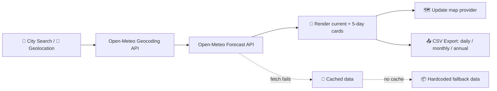

<div align="center">

# 🌦️ Weather App

### A single-file, zero-dependency weather dashboard with live data, maps, and exports

[](https://kumarnarendra0619.github.io/weather-app/)
[](https://kumarnarendra0619.github.io/weather-app/)
[](#-license)
[](#)


**No build step. No frameworks. No server. Just open `index.html`.**

</div>

---

## ✨ Features

<table>
<tr>
<td width="50%" valign="top">

### 🔎 Search & Location
- 🏙️ City search powered by Open‑Meteo geocoding
- 📍 "Use my location" via browser geolocation
- 🕘 Recent searches saved as quick-access chips
- 🎯 GPS accuracy + data-source accuracy scoring

</td>
<td width="50%" valign="top">

### 🌡️ Live Weather Data
- Current temperature, feels-like, humidity, dew point
- Wind speed/gusts/direction, pressure, visibility
- Cloud cover, UV index, precipitation, snowfall
- 5-day forecast with sunrise/sunset & rain probability

</td>
</tr>
<tr>
<td width="50%" valign="top">

### 🗺️ Multi-Provider Maps
- Google Maps · OpenStreetMap · Bhuvan · Aerial imagery
- Zoom in / zoom out controls
- DigiPIN lookup for precise Indian geo-addressing

</td>
<td width="50%" valign="top">

### 📤 Data Export
- ⚡ One-click fast export (daily + monthly + annual)
- 📅 Daily CSV — full current forecast breakdown
- 📆 Monthly / 📈 Annual aggregated CSV via historical archive
- 🌓 °C / °F toggle, persisted across sessions

</td>
</tr>
</table>

---

## 🚀 Quick Start

```bash
# Clone it
git clone https://github.com/KumarNarendra0619/weather-app.git
cd weather-app

# Open it — that's it, no install step
start index.html      # Windows
open index.html        # macOS
xdg-open index.html    # Linux
```

Or just visit the **[live demo](https://kumarnarendra0619.github.io/weather-app/)** — hosted free on GitHub Pages. 🎉

---

## 🧭 How It Works



---

## 🎨 Design Highlights

| Aspect | Details |
|---|---|
| 🖋️ Typography | Sans-serif, 15px body, system font stack |
| 🌗 Theming | Auto light/dark via `prefers-color-scheme` |
| 🎨 Accent color | Dynamically shifts per weather condition |
| 📱 Layout | Centered narrow column, fully responsive |
| ♿ Accessibility | `prefers-reduced-motion` respected, ARIA labels on controls |

---

## 🗂️ Tech Stack

<div align="left">


</div>

No npm, no bundlers, no backend — a single portable `index.html` file.

---

## 📁 Repository Structure

```
weather-app/
└── index.html   # 🎯 Everything: markup, styles, and logic in one file
```

---

## 🤝 Contributing

Pull requests are welcome! Ideas for future enhancements:

- [ ] Hourly forecast view
- [ ] Weather alerts / severe warnings
- [ ] PWA offline support
- [ ] Additional language localization

---

## 📄 License

Released under the **MIT License** — free to use, modify, and share.

<div align="center">

Made with ☀️ 🌧️ ❄️ and Copilot

</div>
